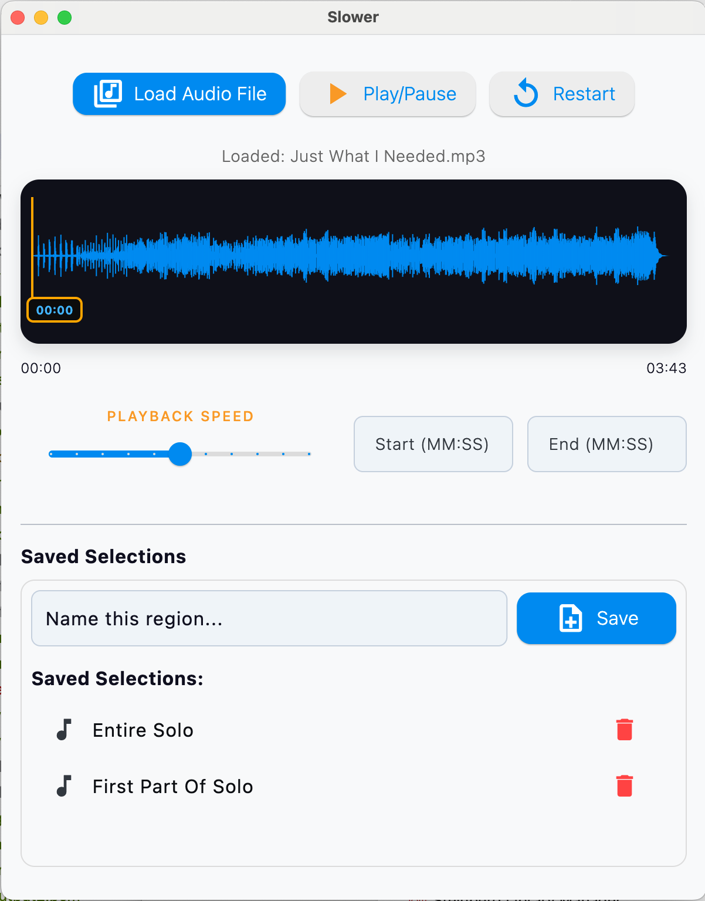

# 🎶 Slower

**Slower** is a desktop audio playback tool for musicians, language learners, and obsessive listeners who want to zoom in, loop, and slow down parts of an audio file with precision.

Built using [Flutter](https://flutter.dev), Slower combines an intuitive waveform UI with loop control, playback speed adjustment, and persistent region saving.s

Flutter is cross platform, and thus Slower is too. However, to date it has only been built on MacOS. Builds on Windows
and Linux platforms coming soon. 

---

## ✨ Features

- **Load `.wav` or `.mp3` files**
- **Visual waveform display** with click-to-seek support
- **Loop any region** by clicking and dragging
- **Fine-tune loop start and end** via MM:SS input fields
- **Playback speed control** (0.5× to 1.5×)
- **Name and save regions** for each file
- **Auto-persisted** region data (per audio file)
- **Snappy native performance** (built for macOS)

---

## 🖥️ Screenshot



---

## 🛠️ Installation

### Coming Soon: Pre-built binary

As binaries become available you will be able to downloae pre-build binaries.

### 🧪 Build from source

1. Install Flutter with macOS desktop support  
   [Flutter installation guide](https://docs.flutter.dev/get-started/install)

2. Clone the repo:

```bash
git clone https://github.com/YOUR_USERNAME/slower.git
cd slower
./scripts/macos_build_ffmpeg_universal.sh
./scripts/macos_copy_ffmpeg.sh
```

Next, the ffmpeg binary built by the previous steps needs to be manually added to the app bundle:

1. Open the Xcode workspace:
```
   open macos/Runner.xcworkspace
```
2. In the Project Navigator (left sidebar), right-click Runner →
➤ "Add Files to 'Runner'..."
➤ Select your ffmpeg binary (./macos/Runner/Resources/ffmpeg)


Then build the app:
```bash

flutter build macos
open build/macos/Build/Products/Release/Slower.app

```

